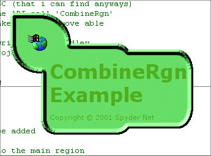



## Complex Regions On Forms \(at last\!\)

### Description

This is the first code EVER on PSC (that i have found) which can tell you how to use the CombineRgn API call. Using this forms like the ones in WinMediaPlayer can be made. No more simple rectangles! You can have holes in the middle of your form or a menu off the side! Please rate this code and leave your comments!
 
### More Info
 

             |
---                |---
**Submitted On**   |2001-11-18 18:22:24
**By**             |[Nick Ridley](https://github.com/Planet-Source-Code/PSCIndex/blob/master/ByAuthor/nick-ridley.md)
**Level**          |Beginner
**User Rating**    |4.4 (62 globes from 14 users)
**Compatibility**  |VB 6\.0
**Category**       |[Windows API Call/ Explanation](https://github.com/Planet-Source-Code/PSCIndex/blob/master/ByCategory/windows-api-call-explanation__1-39.md)
**World**          |[Visual Basic](https://github.com/Planet-Source-Code/PSCIndex/blob/master/ByWorld/visual-basic.md)
**Archive File**   |[Complex\_Re3591711182001\.zip](https://github.com/Planet-Source-Code/nick-ridley-complex-regions-on-forms-at-last__1-28988/archive/master.zip)

